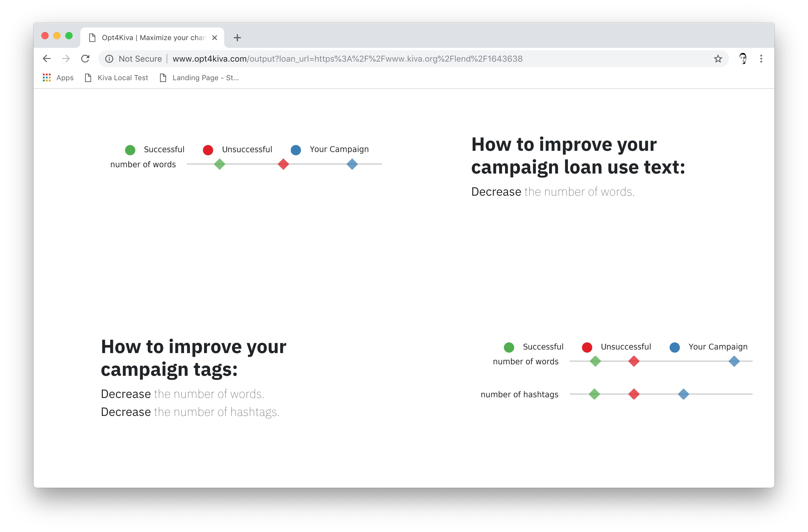

# Kiva-Insight

Users on the the crowdfunding microloan funding website Kiva.org, have a 4.6% failure rate in terms of acquiring loan funding. My aim is to help all users improve their chances of being funded, including foreign-speaking users since the loans they are seeking will significantly improve their quality of life. Most loan applicants/users are common people from developing countries or their translators.

My solution is a machine learning product that predicts the probability of a crowdfunding loan being successful with logistic regression. It also gives recommendations on how to improve the structure of some the text boxes on the campaign website by ranking their logistic regression coefficients.


The product is a website where users of Kiva can enter their crowdfunding URL into a text search box. After pressing on the GO! button, the users are brought to a second page where they are shown the probability of their campaign's success and are also show the top 6 suggestions on how to improve their page layout.

## Getting Started

These instructions will get you a copy of the project up and running on your local machine for development and testing purposes.

### Prerequisites

#### Python and Packages

This project requires an installation of Anaconda 5.2.0, Python 3.6, with 1) the latest conda installs: numpy, pandas, sklearn, matplotlib, seaborn, and flask, and 2) the pip installs: iso-639, pycountry.

#### Data

This dataset provided by the URL (http://s3.kiva.org/snapshots/kiva_ds_csv.zip) includes a zip file. Inside, the dataset of interest is called 'loans.csv' which includes data from expired and funded Kiva campaigns. It has 34 variables, some of which are scraped text, some are numerical, some are datetime, and some are categorical. The variable names are: "LOAN_ID", "LOAN_NAME", "ORIGINAL_LANGUAGE", "DESCRIPTION", "DESCRIPTION_TRANSLATED", "FUNDED_AMOUNT", "LOAN_AMOUNT", "STATUS", "IMAGE_ID", "VIDEO_ID", "ACTIVITY_NAME", "SECTOR_NAME", "LOAN_USE", "COUNTRY_CODE", "COUNTRY_NAME", "TOWN_NAME", "CURRENCY_POLICY", "CURRENCY_EXCHANGE_COVERAGE_RATE", "CURRENCY", "PARTNER_ID", "POSTED_TIME", "PLANNED_EXPIRATION_TIME", "DISBURSE_TIME", "RAISED_TIME", "LENDER_TERM", "NUM_LENDERS_TOTAL", "NUM_JOURNAL_ENTRIES", "NUM_BULK_ENTRIES", "TAGS", "BORROWER_NAMES", "BORROWER_GENDERS", "BORROWER_PICTURED", "REPAYMENT_INTERVAL", "DISTRIBUTION_MODEL" Where "STATUS" is the label variable.

Extract 'loans.csv' and place it in the project's root directory.

## Running the code

Before running any code, create the directories 'saved_data' and 'queries' in the project root directory. Note that Steps 1 and 2 are required prior to running the Flask web app.

### Step 1

To run the hyperparameter grid search, in a terminal `cd` into the working directory of the project, then type:

```bash
$ python cross_validation_grid_search.py
```

### Step 2

To generate the statistics for features of interest, required for the web app, type:

```bash
$ python funded_stat.py
```

### Step 3

To generate the grid search results plots and the confusion matrix plot from the test data, type:

```bash
$ python cv_results_heatmap.py
```

### Step 4

To generate plots for the feature ranking, type:

```bash
$ python top_features.py
```

### Step 5

To run the Flask web app locally, type:

```bash
$ python run.py
```

then go to http://0.0.0.0:5000/ in your favorite web browser to launch the webapp.


## Final product: Flask webapp

Once the Flask webapp is deployed on an AWS EC2 instance and the IP address is forwarded to your domain name, you can expect to have a website with a landing page that looks like:


where you can paste your Kiva campaign URL into the search box. After hitting 'GO', the 'Campaign Analyzed' page appears like this:


... and continue scrolling down to see recommendations


... keep scrolling to see the final recommendations.



## Launched webapp

Visit www.opt4kiva.com to experience the functional Flask+Bootstrap webapp.


## Authors

* **Jason Boulet** - *Initial work* - [far-from-normal](https://github.com/far-from-normal)


## License

This project is licensed under the MIT License.
